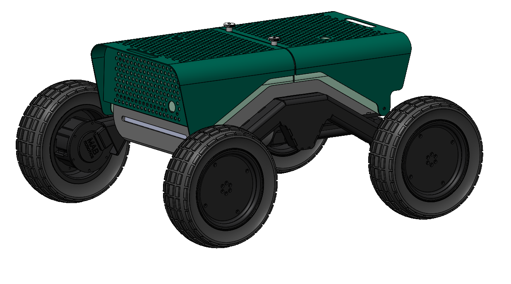

# CURTmini

> **Available for Purchase**
>
> CURTmini is developed for research institutions and universities. The system can be highly customized to meet specific research needs.
>
> **From €17,200**
>
> Interested? Contact us via: +49 711 970-1371 or kevin.bregler@ipa.fraunhofer.de

This repository contains documentation and ROS packages for the CURTmini robot from Fraunhofer IPA.

Read the documentation at: https://ipa320.github.io/curt_mini/
