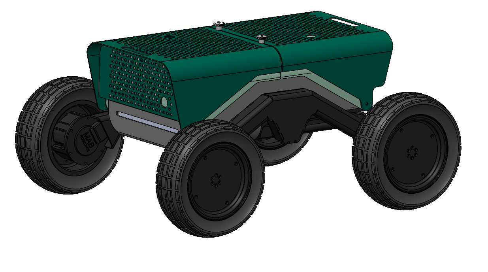

.. CURTmini documentation master file, created by
   sphinx-quickstart on Tue Sep 23 16:42:03 2025.

Welcome to CURTmini's documentation!
====================================

.. toctree::
   :maxdepth: 2
   :caption: Contents:

   electronics
   software_setup
   sensors
   motor_control
   ros_base
