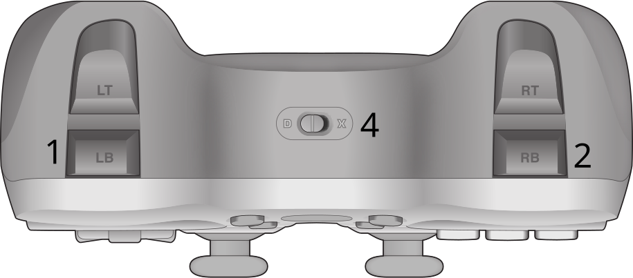
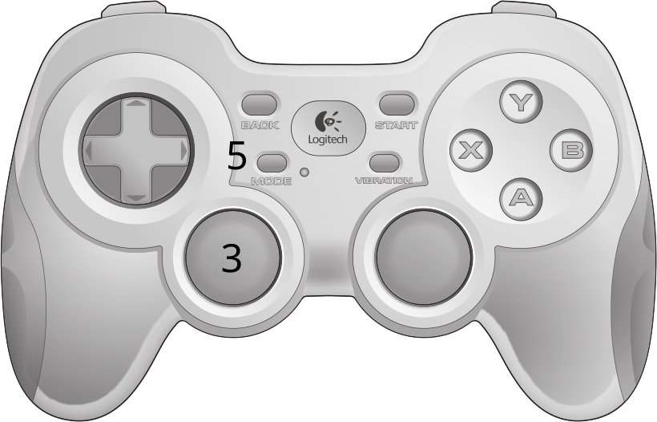

########
ROS Base
########

============
Launch Files
============

To launch the entirety of the CURTmini base, launch:

.. code-block:: console

    $ ros2 launch curt_mini robot_base.launch.py

The other launch files are included from that launch file, and not intended to be used separately.

==================
Hardware Interface
==================

Using ros2_control, see :ref:`motor_control`.

===============
Base Controller
===============

CURTmini uses differential drive, and always applies the same command to the front and back wheels of each side.
CURTmini is able to turn on the spot, but on surfaces with exceptionally high friction, it is advised to configure the local planner with a minimum turning radius for smoother driving.

The base controller takes the output of the twist mux as input, so any velocity commands should be sent to the appropriate twist mux input instead of the base controller directly.

The configuration can be adjusted in `ros2_control.yaml`_.

.. _`ros2_control.yaml`: https://github.com/ipa320/curt_mini/blob/main/curt_mini/config/ros2_control.yaml

=========
Twist Mux
=========

A twist multiplexer is configured to handle multiple twist/velocity commands into the robot base.
The default configuration is as follows:

+----------+-------------------------+---------------------+--------------------+
| Priority | Input                   | Topic               | Expected Frequency |
+==========+=========================+=====================+====================+
| 1        | Joystick/Remote Control | /joy_teleop/cmd_vel | 50Hz               |
+----------+-------------------------+---------------------+--------------------+
| 2        | Navigation              | /cmd_vel            | 20Hz               |
+----------+-------------------------+---------------------+--------------------+
| 3        | Zero (immediate stop)   | /zero_twist/cmd_vel | 10Hz               |
+----------+-------------------------+---------------------+--------------------+

The configuration can be adjusted in `twist_mux.yaml`_.

.. _`twist_mux.yaml`: https://github.com/ipa320/curt_mini/blob/main/curt_mini/config/twist_mux.yaml

========
Joystick
========

   Rear of the controller. Ensure switch 4 is set to X. Hold LB (1) for slow driving, hold RB (2) for fast driving.

   Front of the controller. Ensure mode (button 5) is set to normal (LED off). Control linear and rotational velocity using left stick (3).

Driving the robot manually is possible using the controller.
To control the robot, it is required to hold down either LB for slow driving or RB for fast driving.
Steering and accelerating is done using the left thumbstick.

The configuration can be adjusted in `joystick.yaml`_.

.. _`joystick.yaml`: https://github.com/ipa320/curt_mini/blob/main/curt_mini/config/joystick.yaml
